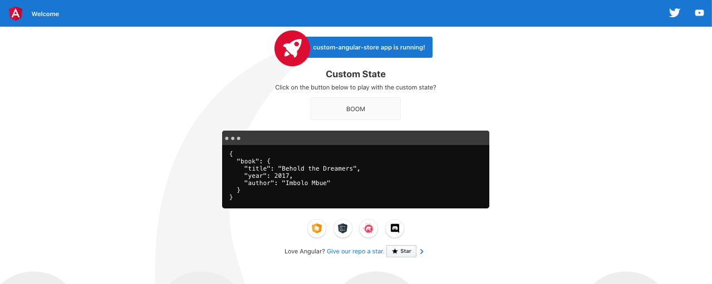
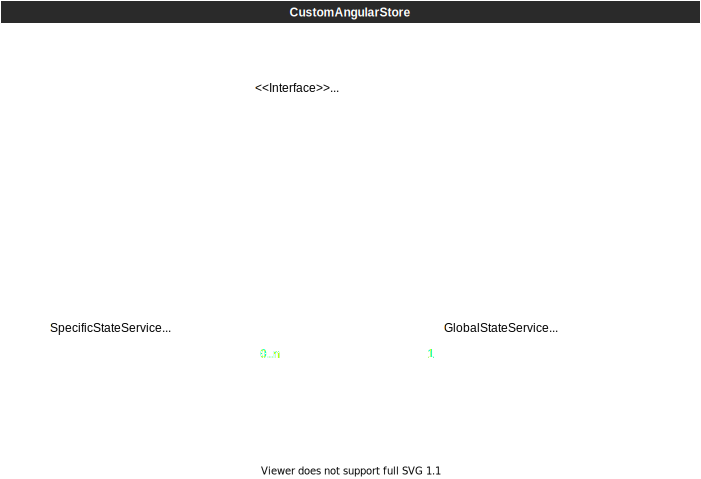

# CustomAngularStore [](https://blog.numericaideas.com/custom-rxjs-store-architecture)

Custom state management architecture using **[RxJS](https://rxjs.dev) Subjects**, generated with [Angular CLI](https://github.com/angular/angular-cli) version 12.2.8.

As a developer, building frontend applications is becoming less difficult using a set of techniques that have been standardized with time, within that jargon, one of these is the State Management System which is a hype amongst frontend developers using frameworks like Angular, React, VueJS, and so on. Simply said, it’s commonly referred to as a store or a global JavaScript object shareable between UI components.

In this [article](https://blog.numericaideas.com/custom-rxjs-store-architecture), I will walk you through a basic yet solid RxJS implementation of a kind-of custom store usable for some specific cases to make your DOM elements more reactive without adding many batteries on.

## Demo
From within the root folder, you should install the dependencies using the command npm install, and run the App with npm start to have the page accessible at http://localhost:4200 which is similar to the following screenshot:



By clicking on the button BOOM, the book's title and year are updated so the changes are being reflected in the global state Observable printed in the black terminal display just down.

## Why a State Management System?
As introduced earlier, it’s just like a global variable where you keep the data that flow through your components, a fashioned way to reactively load and populate data on the UI using a common syntax that boils down to the definition of Actions, Effects, and Reducers.

It’s always a hard question to determine if we need such a pattern within our App, but it’s a good idea to consider for any App projected to scale in a medium or long-term plan since it reduces the complexity while updating non-related UI elements.

They are used to delegate a specific file/function to act, once the result is generated, it’s saved (state change), then it fires an event to notify DOM elements that need it, and the UI refreshes for the end-user to see the expected content.

## Architecture Diagram



Building a store using RxJS gives more confidence with the fact that most of the JS developers will quickly get familiar with the syntax since it's the same basics functions and calls being done no matter the programming languages (nothing new), the only addition is the Reactivity (live updates) brought in by this framework.

A second and very important advantage is the ability to quickly export almost the same code to other frontend projects (not frontend framework dependant) and it's going to work with very less code changes, as soon as the package RxJS is being included as a dependency.

Let me guide you through what I used to implement for Angular App respecting the context I highlighted in the previous section, the same applies to other frontend frameworks (React ...), it consists of:

An interface the state services must implement.
Some models that describe the information managed by state services.
A global state service that handles the App global state.
Multiple local/specific state services for some particular scenarios.

### The State Interface

There is the concept of global and local/specific states, both sharing the same core definition but are being used differently depending on the context, within their similarities the functions set and get are very important:

The 'set' function updates the state value.
The 'get' function returns a specific subject for further subscriptions (listening to changes).

```
export interface StateInterface {

    /**
     * Gets a state subject to listen to.
     */
    get(): BehaviorSubject<any>;

    /**
     * Sets a global/specific state value (object).
     * @param object The object to set as state value.
     */
    set(object: any): void;

}
```

### State Models
The state models are just plain TypeScript definitions of some fields, let's notice the inclusion of a local/specific state (BookState) into the global one:

```
/**
 * The specific book state model.
 */
export interface BookState {
    title?: string;
    year?: number;
    author?: string;
}
```

```
/**
 * The global custom state model.
 */
export interface CustomState {
    fieldA?: string;
    fieldB?: string;
    year?: number;
    book?: BookState;
    // ...
    // etc.
}
```

### Global and Specific State Services
By calling the states' services set functions, we can update the content of the states regardless if it's a global or a specific one.

Included in this sample architecture is a BookService to keep a book (selected) in our store, and once updated, the change is reported to the global state service as shown in the following lines of codes:

```
@Injectable({ providedIn: 'root' })
export class BookService implements StateInterface {
    private bookSubject: BehaviorSubject<BookState> = new BehaviorSubject<BookState>(DEFAULT_BOOK);

    constructor(private stateService: StateService) {}

    /**
     * Returns the book details.
     */
    get(): BehaviorSubject<BookState> {
        return this.bookSubject;
    }

    /**
     * Applies some changes to the book state.
     * @param stateChanges The changes (an object) to populate.
     */
    set(stateChanges: BookState): void {
        if (!stateChanges) return;
        const book: BookState = { ...this.bookSubject.getValue(), ...stateChanges };
        this.bookSubject.next(book);
        this.stateService.set({ book });
    }

}
```

The specific states' services can be used directly once injected, but providing a facade to these appeared more centralized and easier to manage along the way. Meaning all the actions being done by those specific states should be able to be found in the global one.

```
@Injectable({ providedIn: 'root' })
export class StateService implements StateInterface {
    private stateSubject: BehaviorSubject<CustomState> = new BehaviorSubject<CustomState>({ book: DEFAULT_BOOK });

    // ...

    /**
     * Applies some changes to the global state.
     * @param stateChanges The changes (an object) to populate.
     */
    set(stateChanges: CustomState): void {
        if (!stateChanges) return;
        const currentStateValue = this.stateSubject.getValue();
        this.stateSubject.next({ ...currentStateValue, ...stateChanges });
    }

    /**
     * Gets a global/specific state value by its key.
     * @param key Optional key, if not provided we return the global state object.
     */
    value(key = ''): any {
        const globalState: any = this.stateSubject.getValue();
        return key ? globalState[key] : globalState;
    }

    // ...

    /**
     * Sets the book details.
     * @param details A book object with many fields.
     */
    setBookDetails(details: BookState): void {
        this.bookService.set(details);
    }

}
```

So from anywhere within the App, by calling setBookDetails, the selected book will be updated and the changes propagated to all listeners of the RxJS observable, a BehaviorSubject is an Observable by inheritance.

Once the services are configured normally, from any components we can simply load the App state like the following:

```
currentState$: BehaviorSubject<CustomState> = this.stateService.get();
```

Then, in the template it’s possible to show that observable once it's accessible using the async pipe:

```
<div>{{ currentState$ | async }}</div>
```

## Difference Between NgRx/Store and RxJS
By focusing on NgRx (for Angular developers) I’m outlining a clear difference as a transition to the main focus of this article, both systems tend to solve the same problem, at least they are both reactive and can keep our App’s data ready to be ingested by components. It’s important to differentiate that NgRxStore is the implementation of Redux pattern using RxJS underneath, so it defines a nice syntax shareable amongst developers to solve the same problem.

RxJS is a JS library that empowers so many others by adding reactive programming within our App, it has been used in so many ways to perform that same reactivity using different patterns/syntaxes, that’s why today we have frameworks like:

- NgRx
- NGXS
- Akita

## Do I Need any State Library?
It's pretty common to see newcomers using state libraries implicitly, more advised ones always have that question on their table when they have new projects to build, DO I NEED IT SOON OR LATER?

State management libraries are shiny, and good but do we always need these? I agree that with the new agility brought in modern  [click here to read the full content ...](https://blog.numericaideas.com/custom-rxjs-store-architecture).

## Development server

Run `ng serve` for a dev server. Navigate to `http://localhost:4200/`. The app will automatically reload if you change any of the source files.
